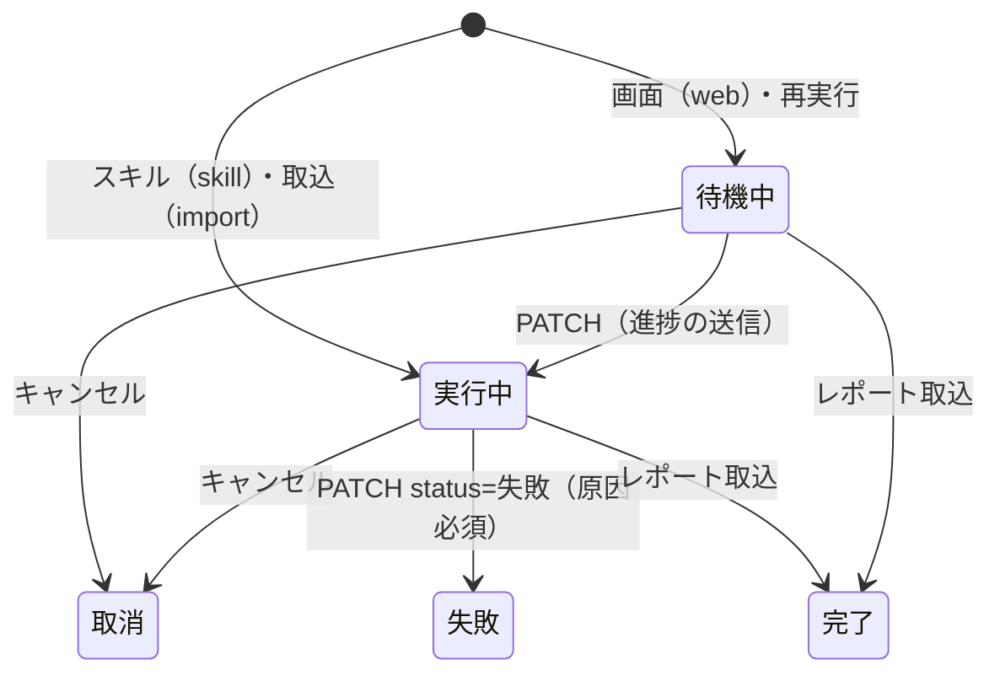

# feat-ai-analysis-screen 設計（SYS-AIA-P02）

最終更新: 2026-09-25。画面の部品境界、サーバの層、API、表、依頼の状態遷移、他 feature との契約を書く。根拠章は backend・ui-ux・database（qa-089〜qa-095、appr-015）。

## 1. 部品境界（web/）

```
AnalysisPage（/analysis。チャンネル管理を key にして状態を作り直す）
├─ RequestPanel（①依頼）
│   ├─ PeriodSelector（variant=analysis。最新28日/90日/1年/任意）→ 任意は Modal 内の DateRangePicker
│   ├─ 補足指示（INSTRUCTION_MAX=1000 を countChars で数えて表示。超えたら送信を止めて警告）
│   ├─ 『Claude Code用プロンプトをコピー』→ 失敗時 ManualCopy（選択状態の textarea）
│   └─ DataSummaryCard と『使用データを確認』モーダル
├─ RequestStatusTable（②実行状況。ProgressBar・ConfirmDialog・『自動』バッジ）
├─ ReportList ＋ ResultImportPanel（③レポート）
├─ ReportDetail（タブ6つ・ChangesSincePrevious・PsychBox・ActionChecklist・VersionHistory・VersionDiffModal）
└─ SelectionBar（aside.selection-bar。ID・依頼内容・進捗・『詳細を開く』）
```

- 共通部品として `web/components/ProgressBar.tsx`（role=progressbar、% を文字でも出す）と `web/components/DateRangePicker.tsx` を足した。期間の選択は `web/components/PeriodSelector.tsx` にまとめ、AppShell（variant=header）と RequestPanel（variant=analysis）が共有する。
- 期間の規則は `src/domain/period.ts`（`PERIOD_MAX_DAYS=366`、終わりは JST の昨日まで）。`web/period.ts` の `usePeriod` は `?period=custom&from=&to=` を読み書きし、他のクエリは残す。
- 選択状態は URL に持つ: `?request=A-xxxx`、`?report=<id>&v=<版>`。一覧（最新20件）に無い依頼は `getRequest` で補う。
- ポーリングは `web/pages/analysis/hooks.ts`（`POLL_MS=10000`）。待機中・実行中があるときだけ動き、`visibilityState=hidden` で止まり、visible に戻ると即再取得して再開する。検索は 300ms デバウンス。
- 色は既存 CSS 変数名だけを使う（qa-080）。900px 未満は2カラムを縦積みにし、表はカード化、下部バーは下部タブの上に固定する（`web/styles.css`）。

## 2. サーバの層

| 層 | ファイル | 役割 |
|---|---|---|
| ルート（セッション） | `src/http/analysis-requests-routes.ts` | TenantContext 必須。取込の本文は readSkillJson がスキルの POST と同じ上限（`src/domain/analysis.ts` の `REPORT_BODY_MAX_BYTES=3,500,000`）で読む |
| ルート（スキル） | `src/http/skill-routes.ts` | Bearer と `X-Skill-Api-Version`。`POST /api/skill/requests` を追加 |
| ユースケース（依頼） | `src/usecases/analysis-requests.ts` | cancelAnalysisRequest・retryAnalysisRequest・getAnalysisRequest・getAnalysisPrompt・getDataSummary・createSkillRequest。権限（content.write）、状態遷移、レート制限、監査 |
| ユースケース（レポート） | `src/usecases/analysis-reports.ts` | importReport・listReports・getReportDetail・diffReports・setReportArchived・registerReportActions |
| リポジトリ | `src/repositories/skill-analysis-repository.ts` ほか | すべての SQL が `tenant_id` を固定する。他チャンネル管理の ID は見つからず 404 |

usecase の分け方と依存の向きは feat-skill-analysis-reports の architecture.md 1節を正本とする。

CSRF は `csrfGuard`（`X-Requested-With: yta`、Origin・Sec-Fetch-Site は同一オリジンのみ）を `/api/*` の書込に掛ける。`/api/skill/` は Bearer 認証なので対象外。

## 3. API

| メソッドとパス | 権限 | 成功 | 主なエラー |
|---|---|---|---|
| `GET /api/analysis-requests?cursor=` | 閲覧者以上 | 200（最新20件） | 400（cursor の誤り） |
| `POST /api/analysis-requests` | content.write | 201（待機中・web） | 400・403・409 `CHANNEL_NOT_CONNECTED`・429 |
| `GET /api/analysis-requests/:id` | 閲覧者以上 | 200 | 404 |
| `GET /api/analysis-requests/:id/prompt` | 閲覧者以上 | 200 | 404 |
| `POST /api/analysis-requests/:id/cancel` | content.write | 200（取消） | 403・404・409 `REQUEST_STATE_CONFLICT` |
| `POST /api/analysis-requests/:id/retry` | content.write | 201（新しい ID、`retry_of`） | 403・404・409・429 |
| `GET /api/analysis/data-summary?from=&to=` | 閲覧者以上 | 200（無い項目は null） | 400 |
| `GET /api/reports?q=&archived=0\|1&cursor=` | 閲覧者以上 | 200（50件ずつ、LIKE は最新200版まで） | 400 |
| `GET /api/reports/diff?a=&b=` | 閲覧者以上 | 200 | 400・404 |
| `GET /api/reports/:id?version=` | 閲覧者以上 | 200（版一覧は listChannelVersions でチャンネルの全版） | 404 |
| `POST /api/reports/import` | content.write | 201（新規）/ 200（同じ内容の再取込） | 403・409・413・422 `INVALID_REPORT_JSON`（line 付き） |
| `PUT` / `DELETE /api/reports/:id/archive` | content.write | 200（冪等） | 403・404 |
| `POST /api/reports/:id/actions` | content.write | 201（`created` と `alreadyRegistered`） | 400・403・404 |
| `POST /api/skill/requests` | トークン＋content.write | 201（実行中・skill） | 403・409・429 |
| `PATCH /api/skill/requests/:id` | トークン＋content.write | 200 | 409 `REQUEST_CANCELED`・409 `REQUEST_STATE_CONFLICT` |

## 4. テーブル（migrations）

| ファイル | 内容 |
|---|---|
| `0013_analysis_requests_extension.sql` | 表を作り直す。instruction（1000字以下）、status に取消、progress 0-100、stage 0-3、retry_of、canceled_at/by、created_via（web/skill/import、既定 web）。PK(tenant_id, request_id)、index (tenant_id, created_at) |
| `0014_report_archives.sql` | PK(tenant_id, report_id)、archived_by、archived_at。reports は追記のみのまま |
| `0015_actions_source_report.sql` | actions に source_report_id・source_key、UNIQUE INDEX `idx_actions_source` (tenant_id, source_report_id, source_key) |

暫定番号 0008〜0010 から付け替えた（`eval-log/renumber-receipt-feat-ai-analysis-screen-20260925.json`）。0008〜0012 は feat-skill-analysis-reports の migration。依頼 ID は `printf('A-%04d', MAX+1)` のチャンネル管理内連番。

## 5. 依頼の状態遷移（qa-089）



終端（完了・失敗・取消）からは動かさない。取消への更新は `status IN ('待機中','実行中')` を条件にした UPDATE で行い、0件なら 409。取消済みへの送信は `REQUEST_CANCELED`、完了・失敗への送信は `REQUEST_STATE_CONFLICT`。再実行は終端の元を変えず、新しい依頼を作る。

## 6. 他 feature との契約

| 相手 | 本 feature が使うもの | 本 feature が変えたもの |
|---|---|---|
| feat-skill-analysis-reports | `parseReport`・`ingestReport`・`readSkillJson`・トークン照合 | `activeRequest` の取消判定、`recentReports` のアーカイブ除外、`POST /api/skill/requests` |
| feat-web-screens-actions | actions 表と改善アクション画面 | actions に列2つと UNIQUE を追加（状態遷移は触らない） |
| feat-settings-channel-link | AppShell・共通部品・連携トークン | AppShell の『任意』期間から DateRangePicker を開く |

レート制限キー `analysis-request:${userId}` を画面の作成・再実行・スキルの作成で共有する（1分10件）。
